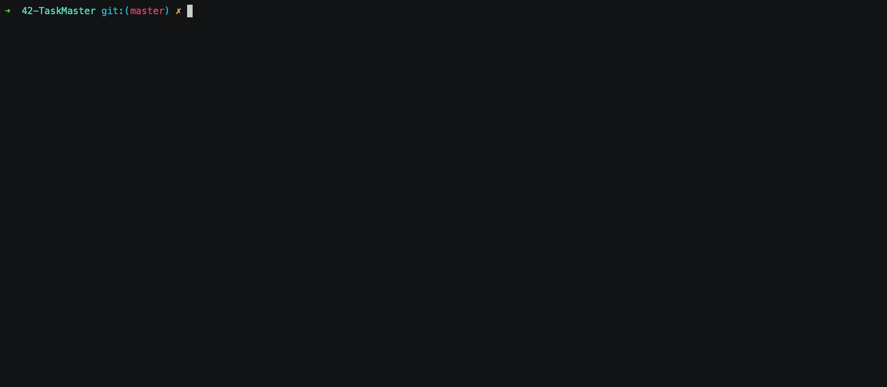
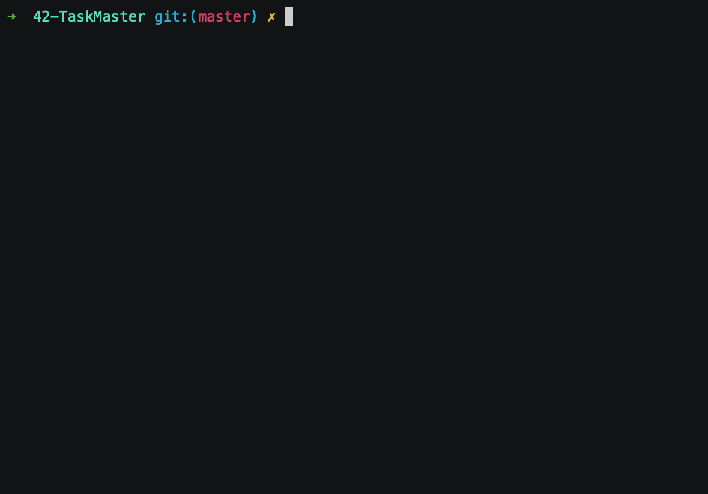
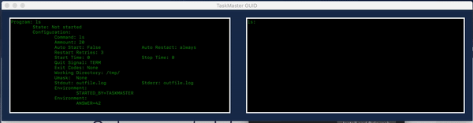

# 42-TaskMaster

Basic task manager that reads from a config.json file and supervises a number of processes.
We were restricted to our language of choice’s standard library. Except for the config file parsing.

The script reads the tasks parameters from the json file, and executes some kind of user prompt to effectively manage these tasks.

The only argument needed is a config file. All info about making your own config file is in exampleconfig.json.

## Project partners

- [Abraham Gimbao](https://github.com/abguimba)
- [Marc Jose](https://github.com/mjose-portfolio)

## Install

- Not needed.

## Configuration

- Create a file in json format with the following characteristics:


```
{                                   
    "programs": {                   #a list of programs
        "sleep": {                  #the name of a program *Required*
            "cmd": "sleep 1000",    #the exact command to launch *Required*
            "cmdammount": 10,       #the number of times you need to launch this process *Required*
            "autostart": true,      #cmd started at launch True/False? *Required*
            "autorestart": "never", #restart this program on "never", "always", or on "unexpected" termination *Required*
            "starttime": 5,         #amount of time to go by before the program is considered "succesfully started" *Required*
            "stoptime": 10,         #amount of time to go by after sending quitsit to program before killing it completely with SIGKILL *Required*
            "restartretries": 3,    #amount of times a program will be tried to be restarted or started at the beginning before giving up on it *Required*
            "quitsig": "TERM",      #signal that will be sent to the command to be gracefully exited (QUIT, TERM, INT, KILL) *Required*
            "exitcodes": "None",    #exitcodes that define an expected termination for use autorestart or None for all exitcodes being considered unexpected
            "workingdir": "/tmp/",  #working directory to be set for the command or None for same working dir as parent(taskmaster)
            "umask": 0,             #umask to be set for the program or None (in decimal (integer)!)
            "stdout": "None",       #option to redirect stdout to file or to simple discard it with "discard" or None
            "stderr": "None",       #option to redirect stderr to file or to simple discard it with "discard" or None
            "env": "None"           #extra env parameters to provide to the new process, "None" for no environment at all, or "default" for the same env as taskmaster
        }
    }
}
```

## Launching method

- `python3 taskmaster.py config_files/<yourconfig>.json`

## Commands

- `help`: List available commands with "help" or detailed help with "help cmd".
- `help <command>`: Prints the description and the method of use of the command.
- `start <program>`: Starts desired program(s). Usage -> start <program name(s)>
- `stop <program>`: Stops desired program(s). Usage -> stop <program name(s)>
- `restart <program>`: Restarts desired program(s) that has already been launched. Usage -> restart <program name(s)>
- `reload`: Reloads the whole configuration. Usage -> reload
- `display`: Opens a window that shows the pre-loaded configuration and the status of the programs to be monitored.

## Examples




